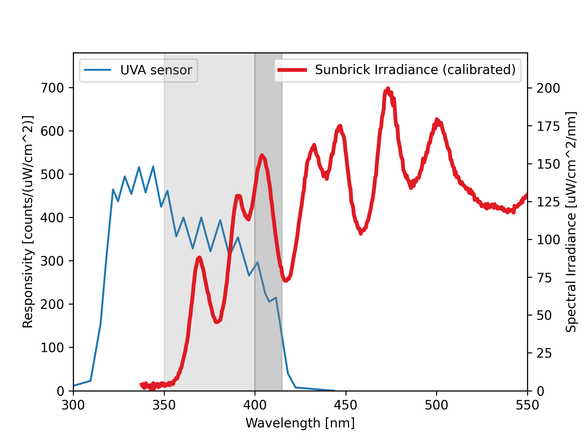
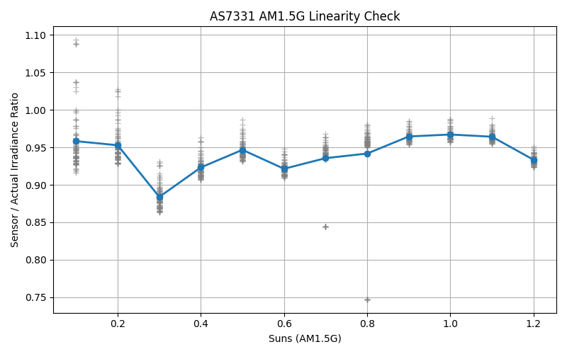

Verified AS7331 performance with calibrated solar simulator light source. All possible combinations of gain, conversion time, and light intensity were tested (`uv_sensor_gain_test_all.ino`).

The solar simulator produces from 0.1 to 1.2 suns of light. The 350-400nm UVA component was measured by the manufacturer and can be found in `AM1.5G sunbrick calibration data.csv`.

We multiply by a factor of 1.4 to scale the solar simulator 350-400nm data to the sensor's actual range. (Calculated by comparing integral of sensitivity * actual irradiance in the two ranges.)

From this, we can see the sensor has reasonably good performance, though there is some variation depending on which gain and conversion time settings are used:

(Out-of-range/noise floor values were not included in this plot. An idealized sensor would have a flat line at 1.00)

Note: It turned out that due to a conversion error in library version <= 0.4.0, in ./data/ the columns uva_mw actually are uva\_uw (see <https://github.com/RobTillaart/AS7331/issues/8>).
