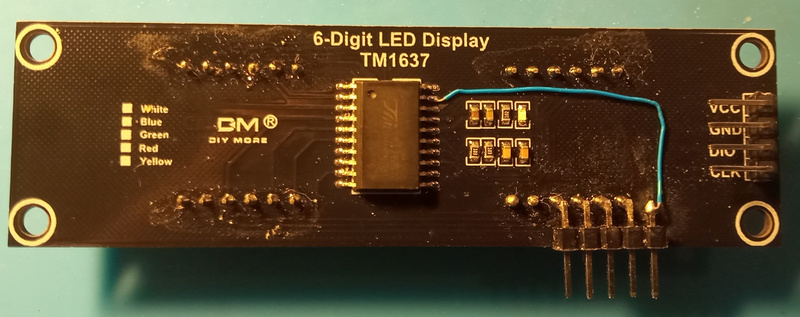
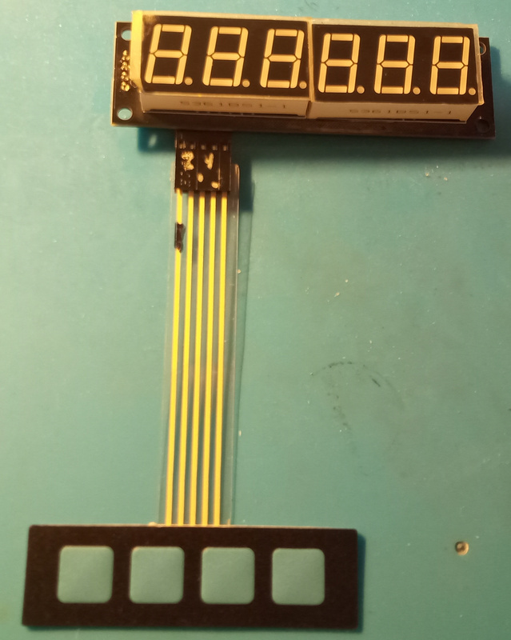
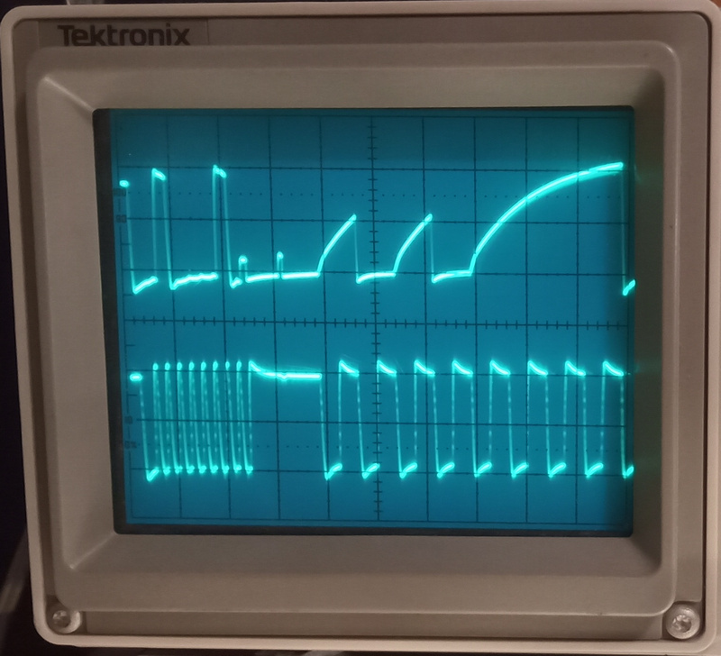
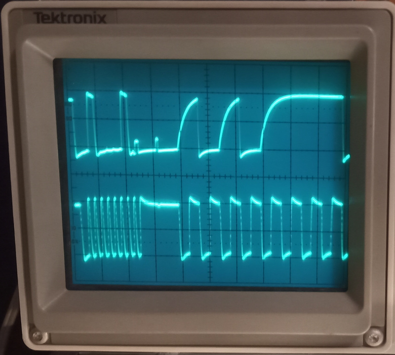

[](https://github.com/marketplace/actions/arduino_ci)
[](https://github.com/RobTillaart/TM1637_RT/actions/workflows/arduino-lint.yml)
[](https://github.com/RobTillaart/TM1637_RT/actions/workflows/jsoncheck.yml)
[](https://github.com/RobTillaart/TM1637_RT/issues)

[](https://github.com/RobTillaart/TM1637_RT/blob/master/LICENSE)
[](https://github.com/RobTillaart/TM1637_RT/releases)
[](https://registry.platformio.org/libraries/robtillaart/TM1637_RT)


# TM1637

Library for TM1637 driven displays and key scans.


## Description

The TM1637 drives 7 segment displays and can also scan a 16 key keyboard.

The library is mainly tested with Arduino UNO, both a 6 digits display and 4 digit (clock) display.
The TM1637 can scan max 2 rows and 8 columns or a smaller keyboard.
It is therefore not possible to scan a "standard" 3x4 or 4x4 matrix keypad.

ESP32 is supported since 0.2.0 see https://github.com/RobTillaart/TM1637_RT/pull/5


#### Related

- https://docs.wokwi.com/parts/wokwi-tm1637-7segment#simulator-examples
- https://github.com/SteveMicroCode/PIC-TM1637-Library-Code
  - includes interesting hardware notes.
- https://github.com/RobTillaart/HT16K33
- https://github.com/RobTillaart/AnalogKeypad
- https://github.com/RobTillaart/I2CKeyPad
- https://github.com/RobTillaart/I2CKeyPad8x8


#### Hardware connection and performance

From tests of SteveMicroCode (See #29) it became clear that the proposed hardware in the
datasheet is very robust but slow. See page 8 datasheet.
Leaving out the 100 pF capacitors on the CLK and DIO line, or dimension them smaller,
allows for faster communication and thus more efficient CPU use. 
More about his tests see - https://github.com/SteveMicroCode/PIC-TM1637-Library-CodeOn 

Additional tests of wfdudley (See Keyboard Scanner section) shows that reducing
the pull up resistor from 10 KΩ to 1000 Ω improves the signal quality.
This too allows for faster communication and efficient CPU use.

Datasheet page 3: _and the clock frequency should be less than 250K_ (KHz)   
This implies that the **setBitDelay()** could be set much lower than the default 10 micro
seconds of the library. On "slower" platforms it might even be 0.
However it is always important to do your own tests if you want to tweak performance
beyond the specifications of the datasheet. 
Interference from other electronic components is often nearby, and if you need longer
cables consider shielded ones.

If you have additional performance tweaks, please let me know.

Note: Ω = ALT-234


## Interface

```cpp
#include "TM1637.h"
```

#### Core

- **TM1637()** constructor
- **void begin(uint8_t clockPin, uint8_t dataPin, uint8_t digits = 6)**
 set up the connection of the pins to the display.
As the display was tested with a 6 digit display first, 
this is used as the default of the digits parameter.


#### Display functions I

- **void displayClear()** writes spaces to all positions, effectively clearing the display.
- **void displayRefresh()** refreshes last written data on display.
To be used e.g. after a **hideSegment()** call.
- **void hideSegment(uint8_t idx)** writes space to a single segment.
- **void hideMultiSegment(uint8_t mask)** writes spaces to 0 or more segments depending on the mask.


#### Display functions II

- **void displayPChar(char \*buff)** display the buffer. 
Experimental - Tested on STM32 and Arduino Nano.
- **void displayRaw(uint8_t \* data, uint8_t pointPos)** low level write function.
Display a point at pointPos (see below).
- **void displayInt(long value)** displays an integer value.
- **void displayFloat(float value)** displays a float value.
Position of point may vary!
- **void displayFloat(float value, uint8_t fixedPoint)** displays a float value with a fixed point position.
- **void displayHex(uint32_t value)** display a number in hexadecimal notation.
- **void displayTime(uint8_t hh, uint8_t mm, bool colon)** displays time format.
The function does not check for overflow e.g. hh > 59 or mm > 59.
Works only on a 4 digit display.
Can be used for 
  - hours + minutes HH:MM 
  - minutes + seconds MM:SS
  - seconds + hundreds SS:hh
The colon can be used e.g. as pulses to indicate seconds etc.
- **void displayTwoInt(int ll, int rr, bool colon = true)** print two integers,
 one left and one right of the colon. 
The function allows a range from -9 .. 99 (not checked).
The colon is default on as separator.
Works only on a 4 digit display.
Applications include:
  - temperature + humidity TT:HH  (humidity to 99%)
  - heartbeat + oxygen HH:OO (both max to 99)
  - meters + centimetre MM:CC  (e.g distance sensor)
  - feet + inches FF:II
  - any pair of integers (-9 .. 99) side by side.


#### Display functions III

- **void displayCelsius(int temp, bool colon = false)** print temperature in **Celsius** format.
The function allows a range from -9 .. 99 + °C.
The colon is default false.
Works only on a 4 digit display.
Colon can be used e.g. to indicate under- or overflow, or any other threshold.
- **void displayFahrenheit(int temp, bool colon = false)** print temperature in **Fahrenheit** format.
The function allows a range from -9 .. 99 + °F.
The colon is default false.
Works only on a 4 digit display.
Colon can be used e.g. to indicate under- or overflow, or any other threshold.

```cpp
TM.displayCelsius(temperature, (temperature < -9) || (temperature > 99));
```

Note that the effective range of Celsius and Fahrenheit differs.
When Fahrenheit goes from -9 to 99 Celsius goes from -26 to 37 (etc).

|   F   |   C   |      |   C   |   F   |
|:-----:|:-----:|:----:|:-----:|:-----:|
|  -9   | -26   |      |  -9   |   16  |
|  99   |  37   |      |  99   |  210  |

A three digit temperature, e.g. range -99 .. 999, or -9.9 .. 99.9 would be possible.
Then one has to leave out either the ° character or the C/F.
As the C/F is far more informative, the choice is fairly easy.
Question is how to API should change, new function of new behaviour?
See future.


#### Brightness

- **void setBrightness(uint8_t brightness = 3)** brightness = 0 .. 7 default = 3.
- **uint8_t getBrightness()** returns value set.


#### KeyScan

- **uint8_t keyScan(void)** scans the keyboard once and return result. 
The keyScan() function cannot detect multiple keys.


#### DisplayRaw explained

**displayRaw()** can display multiple decimal points, by setting the high bit (0x80) 
in each character for which you wish to have a decimal point lit.  
Or you can use the pointPos argument to light just one decimal at that position.

**displayRaw()** can display some of the alphabet as follows:
   - space (blank) is 0x10
   - '-' (minus) is 0x11
   - a-f are coded as 0x0a-0x0f
   - g-z are coded as 0x12-0x25.  Characters that cannot be represented in 7 segments render as blank.
So "hello " is coded as 0x13, 0x0e, 0x17, 0x17, 0x1a, 0x10


#### displayPChar explained

**void displayPChar(char \* buff)** Attempts to display every ASCII character 0x30 to 0x5F. 
See example TM1637_custom.ino to insert your own 7 segment patterns.
Also displayed are  '  ' , '.' and '-' . Decimal points may also be displayed by setting the character sign bit.

See routine **ascii_to_7segment()** in the example TM1637_keyscan_cooked.ino. 
It presents a more convenient interface for displaying text messages on the display.

Routine **button_poll()** in the same example shows one way of polling and de-bouncing button presses.


#### hideSegment() explained

- **void hideSegment(uint8_t idx)** hides a single segment until any other call to display.
- **void hideMultiSegment(uint8_t mask)** hides 0 or more segments depending on the mask.
A 0 bit shows the segment, and a 1 bit hides the segment. 
A mask of 0x00 == 0b00000000 will show all segments.
A mask 0f 0xFF == 0b11111111 will hide all segments. 
- **void displayRefresh()** refreshes last written data on display.

The function **hideSegment()** can be used to
- set focus on an digit, e.g. during an input
- to create an animation e.g. "wave"

The function **hideMultiSegment()** can be used to
- hide a partial display, e.g. in combination with the **displayTwoInt()** 
to alternate between the two values.
- put a display in a LOW ENERGY mode. **displayRefresh()** will refresh the last written data.
- put a display in a DARK mode, e.g. only show the data when a key is pressed (any trigger).
- create an animation, 
- implement blinking in combination with **displayRefresh()**.

Note: **hideMultiSegment()** and **hideMultiSegment()** do not affect the "display cache" 
where **displayClear()** fills the "display cache" with spaces.


#### Obsolete (0.4.0)

- **void init(uint8_t clockPin, uint8_t dataPin, uint8_t digits = 6)** replaced by begin().


#### Display support

The library is tested with a 6 (=2x3) digit - decimal point - display and a 4 (=1x4) digit - clock - display. 
At low level these displays differ in the order the digits have to be clocked in.
To adjust the order for a not supported display, the following function can be used with care:

- **void setDigitOrder(uint8_t a, uint8_t b,... uint8_t h)** sets the order in which up to 8 digits should be clocked in.

If you have a (7 segment) display that is not supported by the library, 
please open an issue on GitHub so it can be build in.


#### Tuning function

**setBitDelay()** is used to tune the timing of writing bytes. 
An UNO can gain up to 100 micros per call by setting the bit delay to 0.
However some displays might fail with short bit delay's.
Do not forget to use a pull up resistor on the clock and data line.

- **void setBitDelay(uint8_t bitDelay = 10)**
- **uint8_t getBitDelay()**


#### Tuning minimum pulse length

The class has a conditional code part in writeSync to guarantee the length of pulses
when the library is used with an ESP32. The function called there **nanoDelay(n)**
needs manual adjustment depending upon processor frequency and time needed for a digitalWrite.
Feel free to file an issue to get your processor supported.

----

## Keyboard Scanner usage and notes

- Kudos to wfdudley for this section - See #11

Calling **keyScan()** returns a uint8_t, whose value is 0xff if no keys are being pressed at the time.  
The TM1637 can only see one key press at a time, and there is no "rollover".  
If a key is pressed, then the values are as follows:

<CENTER>
<TABLE>
<TR>
<TD colspan = 10 align="center">
   keyScan results are reversed left for right from the data sheet.
</TD>
</TR>
<TR>
<TH>pin</TH><TD>&nbsp</TD><TD>2</TD><TD>3</TD><TD>4</TD><TD>5</TD><TD>6</TD><TD>7</TD><TD>8</TD><TD>9</TD>
</TR>
<TR>
</TD><TD>&nbsp;</TD><TH>name</TH><TD>sg1</TD><TD>sg2</TD><TD>sg3</TD><TD>sg4</TD><TD>sg5</TD><TD>sg6</TD><TD>sg7</TD><TD>sg8</TD>
</TR>
<TR>
</TD><TD>19</TD><TD>k1</TD><TD>0xf7</TD><TD>0xf6</TD><TD>0xf5</TD><TD>0xf4</TD><TD>0xf3</TD><TD>0xf2</TD><TD>0xf1</TD><TD>0xf0</TD>
</TR>
<TR>
</TD><TD>20</TD><TD>k2</TD><TD>0xef</TD><TD>0xee</TD><TD>0xed</TD><TD>0xec</TD><TD>0xeb</TD><TD>0xea</TD><TD>0xe9</TD><TD>0xe8</TD>
</TR>
</TABLE>
</CENTER>

To modify a "generic" TM1637 board for use with a keyboard, you must add connections to either
or both of pins 19 and 20 (these are the "row" selects) and then to as many of pins 2 through 9
(the "columns") as needed.  It is easiest to connect to the "column pins" (2-9) by picking them
up where they connect to the LED displays (see second photo).
Generic keyboards that are a 4x4 matrix won't work; the TM1637 can only scan a 2x8 matrix.
Of course, fewer keys are acceptable; I use a 1x4 keyboard in my projects.

Further, the TM1637 chip needs a fairly hefty pull-up on the DIO pin for the keyScan() routine to work.
There is no pull-up in the TM1637 itself, and the clone boards don't seem to have one either,
despite the data sheet calling for 10K ohms pull-ups on DIO and CLOCK.  10K is too weak anyway.
The slow rise-time of the DIO signal means that the "true/high" value isn't reached fast enough and 
reliably enough for the processor to read it correctly. The new pull-up reduces the rise time of the signal, 
so that true/high values are achieved in a few microseconds.
I find that a 1K (1000) ohm resistor from DIO to 3.3 v works well. This is perfect with a 3.3 volt processor 
like the ESP8266 or ESP32, and a 5V Atmega 328 ("Arduino UNO") family processor is happy with that as well.

The TM1637 boards want to be run off of 5 volts, regardless of what the processor voltage is.
Their logic levels are compatible with 3.3 volt processors, and they need 5 volts to make sure the LEDs light up.


The unmodified generic TM1637 board (front and back).


The modified generic TM1637 board with connector for 1x4 keyboard. 
The blue wire is bringing out pin 19 (k1).
Four segments/columns are picked up from the LEDs.



The 4 button keyboard plugged into the TM1637 board.




Scope photo showing slow rise time of DIO pin (upper trace) on the unmodified TM1637.
The lower trace is the CLK.  The 8 fast CLK pulses on the left represent the 0x42 command 
to read keyboard being sent to the TM1637.




Scope photo showing faster rise time of DIO pin (upper trace) with 1000 ohm pull-up on DIO.
In both scope photos, the F5 key is pressed; the bits are least significant bit (LSB) first,
so read as 10101111 left to right.



The scope photos were taken using the TM1637_keyscan_raw example, with the scope trigger 
hooked to the TRIGGER pin, and the two channel probes hooked to DIO and CLK.
Vertical sensitivity is 2v/division, horizontal timebase is 20usec/division.


## KeyScan

Implemented in version 0.3.0  Please read the datasheet to understand the limitations.

```
//  NOTE: 
//  on the TM1637 boards tested by @wfdudley, keyScan() works well 
//  if you add a 910 ohm or 1000 ohm pull-up resistor from DIO to 3.3v
//  This reduces the rise time of the DIO signal when reading the key info.
//  If one only uses the pull-up inside the microcontroller, 
//  the rise time is too long for the data to be read reliably.
```


## Operation

See examples


## Future

#### Must

- refactor readme.md
- **setLeadingZeros(bool on = false)** leading zeros flag, set data array to 0.
- **getLeadingZeros()**

#### Should

- testing other platforms.
- remove degree sign from **displayCelsius()**
  - would allow one extra digit.
  - **displayFahrenheit()** idem.
  - could be optional when needed e.g. below -9 or above 99
  - code complexity?

#### Could

- add parameter for **hideSegment(idx, character == SPACE)** to overrule hide char.
  - space underscore or - are possible.
- add **TM1637_UNDERSCORE** to char set. ```seg[19] == 0x08```
- add **TM1637_UPPERSCORE** to char set. ```seg[20] == 0x01```
- return bytes written as return value for display functions.
  - like print(); or write();
- **void displayHumidity(int hum, bool colon = false)** print humidity in **percent** format.
The function allows a range from 0.00H .. 99.9H or 00.0H ?
Colon to indicate rising / falling ????
- generic function that displays three digits and one char ACDEFH ???
  - common for Celsius and Fahrenheit and Humidity?
- **void displayAmpere(float amps)** Ampere 0.00 - 999 A


#### Wont (unless requested)

- **rotate(bool rot = false)**
  - 180 degree rotation of all digits for mounting  
  - reverse digit order
  - flip every digit (function to overwrite the char array)
- **HUD(bool hud = false)** = Heads Up Display
  - flip every digit
- investigate if code can be optimized 
  - done, => tune setBitDelay()
  - performance measurement
- **displayTest()** function ?
  - not needed just print 88888888
- add debug flag for test without hardware.
  - simulate output to Serial? (HEX)?
  - is now commented code, good enough + dumpcache()
- extend some functions to 6 digit display too?
  - time(hh.mm.ss)
  - Celsius (nn.nn°C)
  - twoInt => threeInt
  - on request only


## Support

If you appreciate my libraries, you can support the development and maintenance.
Improve the quality of the libraries by providing issues and Pull Requests, or
donate through PayPal or GitHub sponsors.

Thank you,

